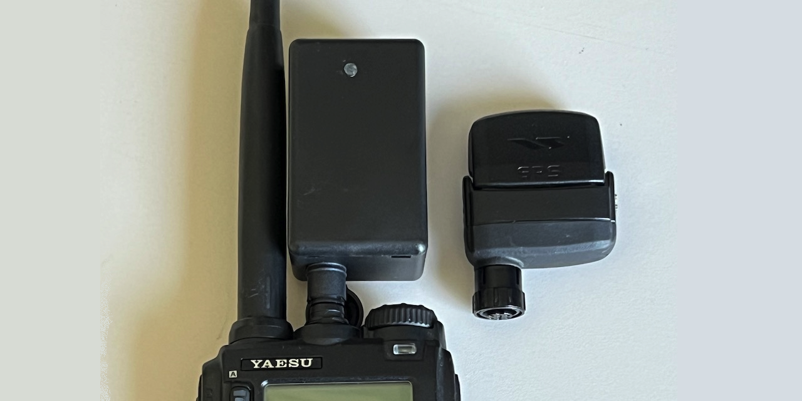

# GPS_Pico_VX8DR
- External GPS module for Yaesu VX-8DR handheld amateur radio using Raspberry Pi Pico

- Background

  The Yaesu VX-8DR handheld amateur radio supports an external FGPS-2 GPS module to set the time and perform APRS operation.  However, these modules are no longer in production (as is the radio), but there is a desire to obtain GPS capability for existing radios.
  
  In researching this capability I found the following web site that details some of the differences between the FGPS-2 GPS module and others and how the VX-8DR radio expects the NMEA strings from the module (as it is non-standard):
  https://lingnik.com/2013/02/09/reverse-engineering-yaesu-vx-8dr-gps-interface.html
  
- Hardware

  I use a Raspberry Pi Pico RP2040-based microcontroller with two UART ports (less than US$10), along with a simple 3.3 volt GPS module (in my implementation it's a Goouuu Tech GT-U7, less than US$10), and a connector to mate to the port on the VX-8DR (I could not find one other than in cable form, about US$10 from Tower Electronics).  The packaging is a small plastic box, with a snip of 1/8" plastic light pipe to be able to see the LED.

  The radio provides:
  - 3.3 volt, which connects to the Pico VSYS pad
  - Ground, which feeds the main Pico ground
  - RX and TX at UART levels, connected to the Pico UART1

  The GPS module connectors:
  - 3.3 volt from the Pico 3V3 pad
  - Ground from one of the Pico GND pads
  - RX and TX connect to the Pico UART0

- Software Requirements

  This implementation uses the MicroPython port for Raspberry Pi Pico RP2040 controllers:
  https://datasheets.raspberrypi.com/pico/raspberry-pi-pico-python-sdk.pdf

- Operation

  Main loops forever reading GPS data.  The sentences are modified to meet the expectations of the Yaesu VX-8DR and sent to the radio.

- Caveats (IMPORTANT!!!)

  The radio does not always stop supplying power to the GPS when it is powered off!!!!!!  Remember to remove the GPS module when powering off the radio!!

  Power comsumption is a fair amount more than the FGPS-2 so your batteries will drain faster.
